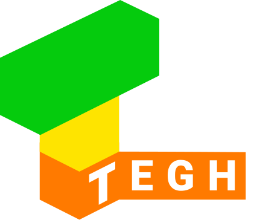

## Tegh

Tegh is an experimental 3D printing software designed from the ground up to streamline your 3D printing experience.

Tegh features a print queue that enables users to easily queue up prints without managing complicated file systems.

With Tegh you can worry less and create more.

<!-- Print from Anywhere Copy -->
<!-- Tegh is an experimental 3D printing software designed from the ground up to streamline your 3D printing experience. Tegh features a print queue that enables users to easily queue up prints without managing complicated file systems. To manage prints remotely Tegh is built on top of encrypted, distributed web technologies so you can use your 3D printer from anywhere in the world just as easily as from your home. With Tegh you can worry less and create more. -->

## Getting Started

1. Download [Beaker Browser](https://beakerbrowser.com)
1. Install the [Tegh Snap for Raspbian and Ubuntu](https://snapcraft.io/tegh)
2. Copy your Invite code from Tegh's logs:
`journalctl -u snap.tegh.tegh.service`
3. Open Beaker and follow the instructions at [dat://tegh.io](dat://tegh.io)

## Hacking

### Dev Installation

1. Install [nvm](https://github.com/creationix/nvm)
2. Bootstrap the dev environment with tegh, node 10 and yarn:
`nvm use && npm i -g yarn && yarn bootstrap`

### Running the Dev Host + Web UI

Disable any other copies of tegh and run `yarn start`

This:
* starts a hot reloading development server using your `~/.tegh/config.json`.
* compiles the tegh-web-ui and watches for changes. To preview the UI open `packages/tegh-web-ui/dist` in Beaker's Library.
* echos an invite code to the command line if you haven't connected already.

### Running the test suite

Run `yarn test`
