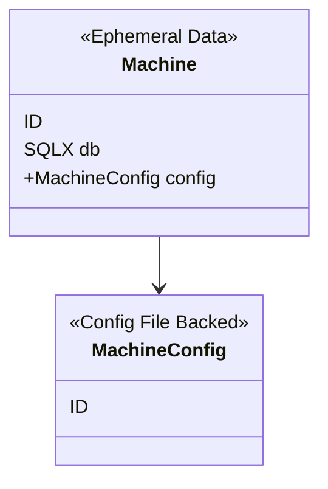
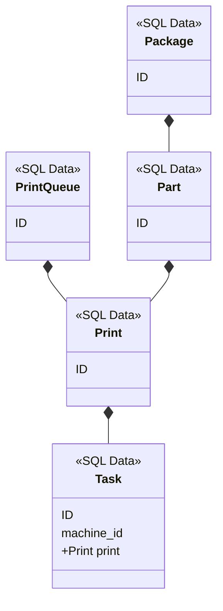

# A new rust architecture
<!--
  template: https://raw.githubusercontent.com/joelparkerhenderson/architecture_decision_record/master/adr_template_madr.md
-->

* Status: draft
* Deciders: d1plo1d
* Date: 2018-11-24

## Context and Problem Statement

Tegh is moving to Rust and some problems have developed in the prototype that need to be addressed to fully embrace Rust:

1. It's becoming a mess of files.
2. Sled's unstable binary & not-widely supported file format does not lend itself to easy user debugging like sqlite.
3. Sled's pub/sub model has led to complicated debugging and using it as the primary means of synchronizing data means that even things that shouldn't be persisted are being saved to disk just to get pub/sub functionality.
4. Without Sled's pub/sub data is not easily synchronized. Actors may replace this more robustly.

We need to make some bigg-ish changes and that makes this an opportune moment to write up an updated architecture to organize this.

## Decision Drivers

Initial experiments in rewriting Tegh modules in rust have shown the language to generally reduce the amount of bugs created and their debugging difficulty. Bug hunts were sometimes quite difficult in Javascript due to it's lack of type safety and null.

But let's be real, in the beginning I just wanted to try out Rust.

## Considered Options

- Sled
- Sqlite as a document store (using one JSON field for all the data in a given struct and indexing into that JSON). Not ideal because it requires (cross-)compiling a sqlite loadable extension.
- Sqlite as a traditional SQL database

## Decision Outcome

### Machine

`packages/machine/`

For `packages/machine/src/[machine|config]`
- `mutations`
- `resolvers`
- `messages`
- `actors` - persistent state machines or ephermal context able to receive messages one at a time.
- `data` or `structs`(?) - SQL or config-backed non-actors with helper functions.

Currently machine information is spread across 3 unintegrated modules:
- machine_config
- ephemeral_machine_data
- machine
- receive_loop
- send_loop

This is cumbursome so instead:

- `ephemeral_machine_data`, `receive_loop` and `machine` should be merged into an actor and not persisted.
- `send_loop` should be replaced by handlers called from GraphQL mutations with the following messages:
  - stop_machine
  - reset_machine
  - pause_task
  - delete_task_history
  - send_task_to_machine
- `machine_config` should be included in tegh-machine package but config file updates managed in a seperate actor.
- tegh-marlin should replace it's duplicated config implementation with a dependency on the machine package.

### Core
`packages/core`

`packages/core/src/[backup|bin|invites|materials|users|video]`

- rename tegh-auth to `core`
- includes `users`, `invites`, and `video` moved up to the top level

### Print Queue
`packages/print-queue`

`packages/print-queue/src/[print-queue|print|task|package|part|macros]`

- print should be refactored into it's own file.

## Pros and Cons of the Options <!-- optional -->

## Links

- https://github.com/sunli829/xactor
